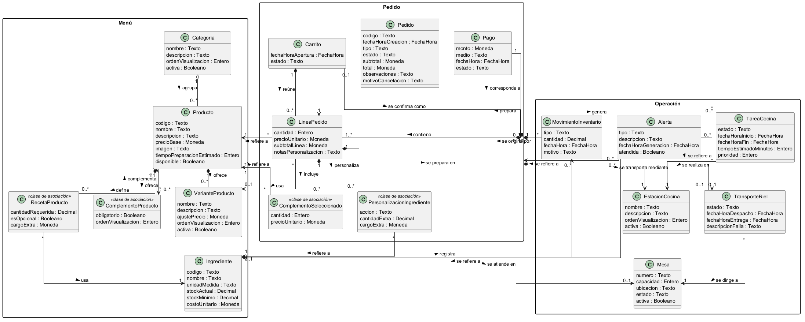
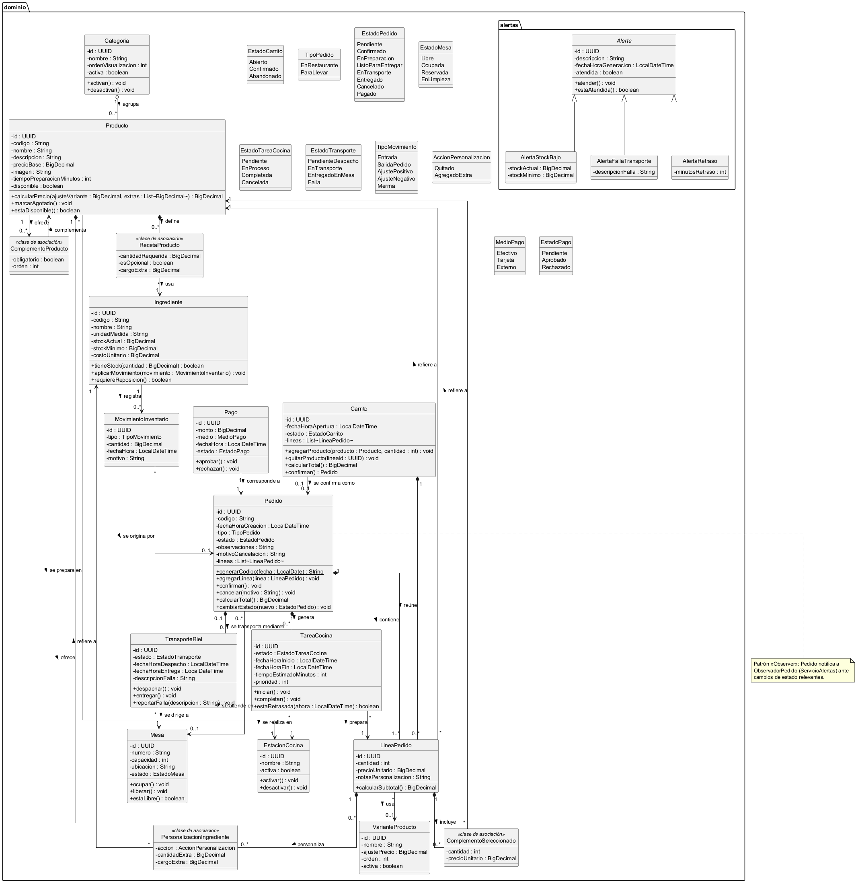
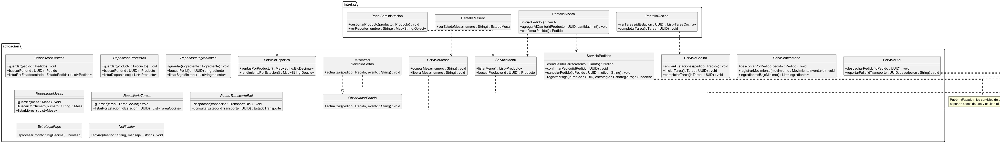

# Sistema de Autoservicio para Restaurante

**Proyecto Final — Diseño de Software**

Restaurante con autoservicio digital: menú en pantallas táctiles, pedidos, cocina por estaciones, entrega por riel, mesas, inventario, notificaciones y reportes.

> **Estado:** análisis y diseño. Aún no hay código fuente; el diagrama de clases es el diseño propuesto.

---

## Diagramas

### Modelo de dominio


### Diagrama de clases — dominio


### Diagrama de clases — arquitectura


### Vista funcional — componentes


<details>
<summary><b>Diagramas de secuencia</b></summary>

**Pedido en kiosco → cocina**


**Preparación → riel → entrega**


**Alerta de stock bajo**


</details>

---

## Documentación

| Documento | Contenido |
|---|---|
| [Especificación funcional](docs/especificacion/especificacion-funcional.md) | 56 historias de usuario (INVEST) |
| [Requerimientos](docs/especificacion/requerimientos.txt) | RF-01 a RF-56 |
| [Modelo de dominio](docs/modelado/modelo-dominio.md) | Conceptos del negocio |
| [Diagrama de clases](docs/modelado/diagrama-clases.md) | Diseño de software |
| [Vista funcional](docs/arquitectura/vista-funcional.md) | Componentes y flujos (Rozanski & Woods) |
| [Wireframes](docs/wireframes/index.html) | 18 maquetas de pantalla |

> **¿Necesitas editarlos?** En [`docs/modelado/fuentes/`](docs/modelado/fuentes/) están las fuentes en **PlantUML** (código) y en **XMI** para **Visual Paradigm**. Ver la [guía de Visual Paradigm](docs/modelado/como-usar-visual-paradigm.md).

---

## Estructura

```
├── README.md
└── docs/
    ├── especificacion/   # Requerimientos e historias de usuario
    ├── modelado/         # Dominio, clases, diagramas y fuentes (PlantUML/XMI)
    ├── arquitectura/     # Vista funcional
    └── wireframes/       # Maquetas de interfaz
```

---

## Integrantes

- Miguel Felipe Ceballos Ramírez

Proyecto académico — uso educativo.
