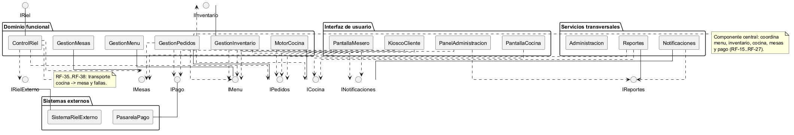
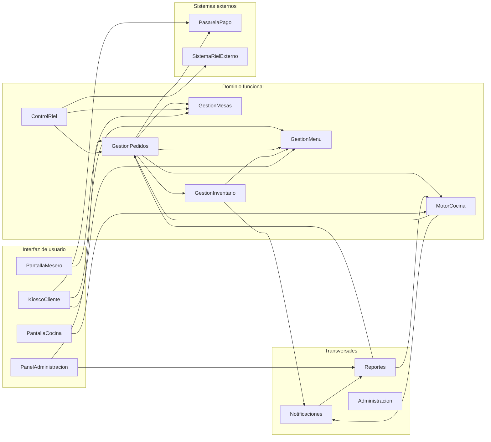
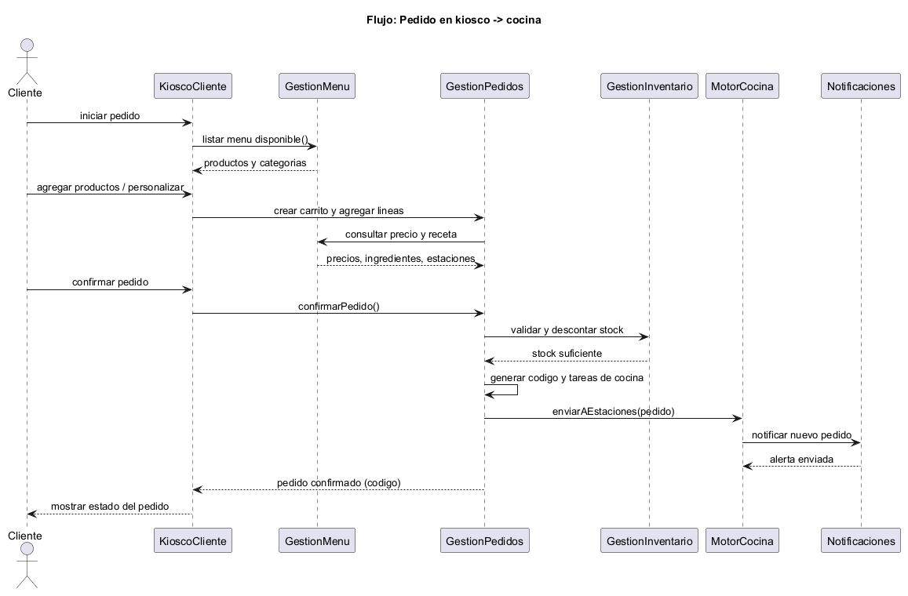
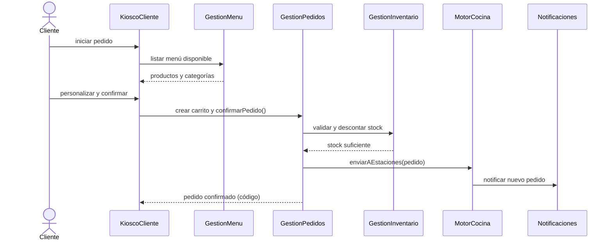
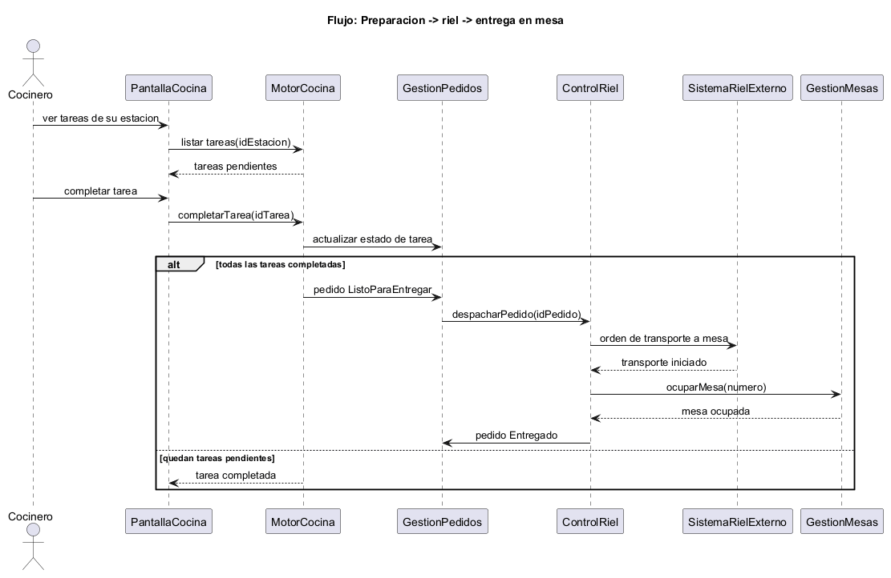
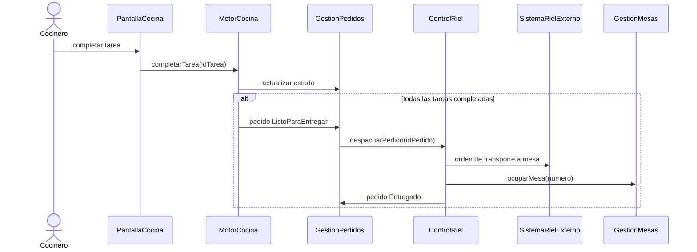
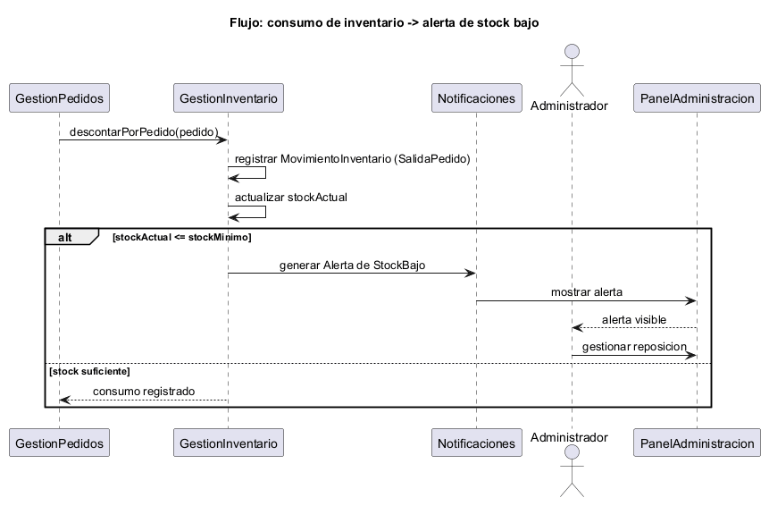
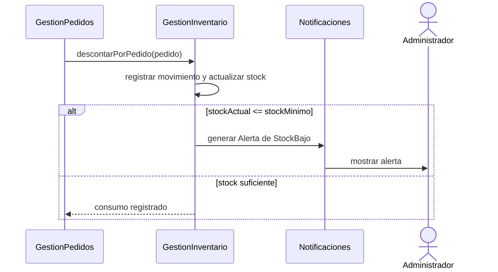

# Vista funcional — Sistema de Autoservicio para Restaurante

> Marco: **Rozanski & Woods** (*Software Systems Architecture*), Viewpoints & Views → **Functional View**.
> Fuente editable del diagrama: [`../modelado/fuentes/vista-funcional-componentes.puml`](../modelado/fuentes/vista-funcional-componentes.puml).

---

## 1. Propósito de la vista

La vista funcional describe **qué hace** el sistema y **de qué elementos funcionales** se compone, con independencia
de su tecnología. Define los componentes de la arquitectura, las **interfaces** que cada uno **ofrece** y **requiere**, y
sus **dependencias**, de modo que se pueda rastrear cada requerimiento funcional hasta el elemento que lo realiza.
Sirve de contrato entre análisis, diseño y desarrollo, y es la base para la estructura de paquetes del código.

---

## 2. Diagrama de componentes

---

## 3. Catálogo de elementos

> **Nota:** el repositorio aún no tiene código. La columna "implementación" indica las **clases/paquetes del diseño**
> ([diagrama de clases](../modelado/diagrama-clases.md)) que implementarán cada componente cuando se programe.

| Componente | Responsabilidad | Interfaces ofrecidas | Interfaces requeridas | Implementación (diseño) |
|---|---|---|---|---|
| **KioscoCliente** | Punto de autoservicio: mostrar menú, armar carrito y confirmar pedido. | — | `IMenu`, `IPedidos`, `IPago` | `interfaz.PantallaKiosco` |
| **GestionMenu** | Administrar catálogo: categorías, productos, variantes, complementos, recetas y disponibilidad. | `IMenu` | `IRepositorioProductos` | `aplicacion.ServicioMenu` + `dominio.Producto/Categoria/VarianteProducto/RecetaProducto/ComplementoProducto` |
| **GestionPedidos** | Crear, confirmar, cancelar y seguir pedidos; carrito, totales y estados. | `IPedidos` | `IMenu`, `IInventario`, `ICocina`, `IMesas`, `IPago` | `aplicacion.ServicioPedidos` + `dominio.Pedido/LineaPedido/Carrito/Pago` |
| **MotorCocina** | Recibir pedidos, repartir tareas por estación, controlar tiempos y retrasos. | `ICocina` | `IPedidos`, `INotificaciones` | `aplicacion.ServicioCocina` + `dominio.TareaCocina/EstacionCocina` |
| **ControlRiel** | Ordenar y seguir el transporte cocina→mesa; reportar fallas. | `IRiel` | `IPedidos`, `IMesas`, `IRielExterno` | `aplicacion.ServicioRiel` + `dominio.TransporteRiel` |
| **GestionMesas** | Registrar mesas y actualizar su estado según el ciclo del pedido. | `IMesas` | `IRepositorioMesas` | `aplicacion.ServicioMesas` + `dominio.Mesa` |
| **GestionInventario** | Controlar existencias, aplicar movimientos y detectar stock bajo. | `IInventario` | `IMenu`, `INotificaciones` | `aplicacion.ServicioInventario` + `dominio.Ingrediente/MovimientoInventario` |
| **Notificaciones** | Generar y difundir alertas y avisos de estado. | `INotificaciones` | `INotificador` (canal) | `aplicacion.ServicioAlertas` + `dominio.Alerta` y subtipos |
| **Reportes** | Consultar ventas, pedidos y rendimiento por estación. | `IReportes` | `IPedidos`, `ICocina` | `aplicacion.ServicioReportes` |
| **Administracion** | Gestionar usuarios/roles y configuración del sistema. | `IAdministracion` | `IMenu`, `IReportes` | `interfaz.PanelAdministracion` + servicios de administración |
| **PasarelaPago** *(externo)* | Procesar el pago de un pedido. | `IPago` | — | `aplicacion.EstrategiaPago` + `infraestructura.PagoEfectivo/PagoTarjeta` |
| **SistemaRielExterno** *(externo)* | Hardware/software del riel. | `IRielExterno` | — | `infraestructura.AdaptadorRiel` |

---

## 4. Flujos de interacción

### 4.1 Pedido en kiosco → cocina (RF-15…RF-23, RF-28)

### 4.2 Preparación → riel → entrega (RF-29…RF-38)

### 4.3 Consumo de inventario → alerta de stock bajo (RF-43…RF-45, RF-53)

---

## 5. Matriz de trazabilidad (requerimiento → componente)

| RF | Componente(s) |
|---|---|
| RF-01–RF-03 (menú, categorías, info de producto) | GestionMenu, KioscoCliente |
| RF-04–RF-06 (ingredientes, variantes, personalización) | GestionMenu, KioscoCliente, GestionPedidos |
| RF-07–RF-08 (complementos, precio automático) | GestionMenu, GestionPedidos |
| RF-09–RF-12 (carrito, totales) | KioscoCliente, GestionPedidos |
| RF-13–RF-14 (disponibilidad) | GestionMenu, GestionInventario |
| RF-15–RF-18 (inicio, tipo, mesa, identificador) | KioscoCliente, GestionPedidos, GestionMesas |
| RF-19–RF-23 (resumen, confirmación, envío, estado) | KioscoCliente, GestionPedidos, MotorCocina |
| RF-24–RF-27 (gestión e historial de pedidos) | GestionPedidos |
| RF-28–RF-31 (envío a estaciones, tareas, tiempos, alertas) | MotorCocina, Notificaciones |
| RF-32–RF-34 (configurar estaciones, carga de trabajo) | MotorCocina, Administracion |
| RF-35–RF-38 (riel y fallas) | ControlRiel, Notificaciones |
| RF-39–RF-41 (mesas y su estado) | GestionMesas, GestionPedidos |
| RF-42–RF-45 (inventario y alertas de stock) | GestionInventario, Notificaciones |
| RF-46–RF-48 (administración del menú) | GestionMenu, Administracion |
| RF-49 (usuarios y roles) | Administracion |
| RF-50–RF-51 (reportes y rendimiento) | Reportes |
| RF-52–RF-53 (notificaciones y alertas) | Notificaciones |
| RF-54–RF-56 (integración y ciclo completo) | Todos (orquestado por GestionPedidos) |

---

## 6. Decisiones y restricciones

- **GestionPedidos como componente central**: concentra la orquestación del ciclo del pedido; los demás componentes
  colaboran a través de sus interfaces, evitando dependencias cíclicas fuertes.
- **Pago como componente externo (`PasarelaPago`)**: el medio de pago se trata como servicio externo; internamente se
  modela con el patrón Strategy, de modo que el resto del sistema no dependa de un proveedor concreto.
- **Notificaciones desacoplada (patrón Observer)**: los cambios de estado del pedido publican eventos; Notificaciones los
  consume y genera alertas, sin que GestionPedidos conozca los canales.
- **ControlRiel aislado tras `IRielExterno` (patrón Adapter)**: el hardware del riel puede cambiar sin afectar al dominio.
- **Restricción**: no hay código fuente en el repositorio; los paquetes de la capa `aplicacion` (servicios) deben
  corresponder 1:1 con los componentes de esta vista cuando se implemente.
