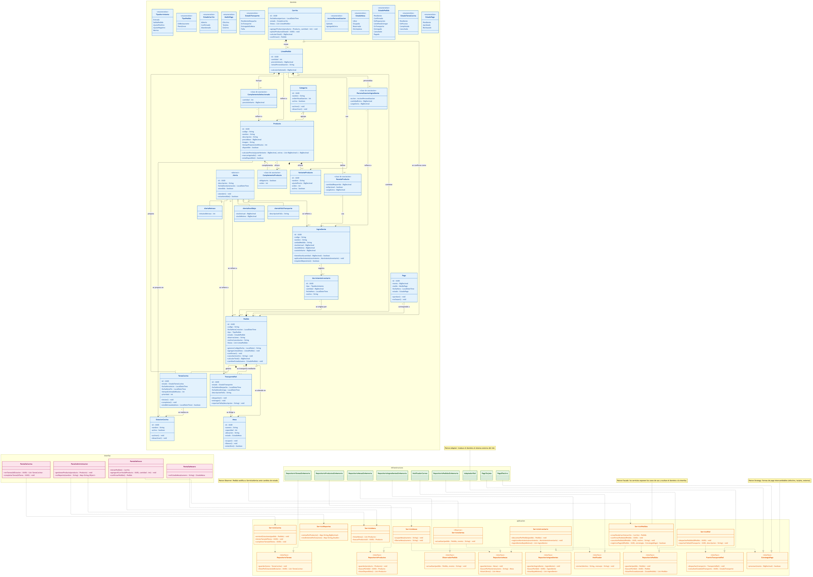

# Diagrama de clases — Diseño de software

> Diseño estático de **todo el sistema** en un solo diagrama: clases con visibilidad, tipos y métodos,
> interfaces, herencia, enumeraciones y patrones. Sin código fuente todavía: es el diseño propuesto.
> La fuente editable es [`diagrama-clases.mmd`](diagrama-clases.mmd) (Mermaid) y esta imagen su render:



## Capas y leyenda de colores

| Capa (namespace) | Color | Responsabilidad | Ejemplos |
|---|---|---|---|
| `dominio` | Azul | Conceptos del negocio con comportamiento | `Pedido`, `Producto`, `Ingrediente`, `Mesa`, `Alerta` |
| `aplicacion` | Naranja | Casos de uso (**servicios**) y **puertos** (interfaces) | `ServicioPedidos`, `RepositorioPedidos`, `EstrategiaPago` |
| `infraestructura` | Verde | Implementaciones técnicas de los puertos | `RepositorioPedidosEnMemoria`, `AdaptadorRiel`, `PagoTarjeta` |
| `interfaz` | Rosa | Puntos de entrada del usuario | `PantallaKiosco`, `PantallaCocina`, `PanelAdministracion` |

## Inventario de clases

### Dominio (31 elementos)

| # | Clase | Tipo |
|---|---|---|
| 1 | `Categoria` | Clase |
| 2 | `Producto` | Clase |
| 3 | `VarianteProducto` | Clase |
| 4 | `Ingrediente` | Clase |
| 5 | `RecetaProducto` | Clase de asociación |
| 6 | `ComplementoProducto` | Clase de asociación |
| 7 | `Carrito` | Clase |
| 8 | `Pedido` | Clase |
| 9 | `LineaPedido` | Clase |
| 10 | `PersonalizacionIngrediente` | Clase de asociación |
| 11 | `ComplementoSeleccionado` | Clase de asociación |
| 12 | `Pago` | Clase |
| 13 | `Mesa` | Clase |
| 14 | `EstacionCocina` | Clase |
| 15 | `TareaCocina` | Clase |
| 16 | `TransporteRiel` | Clase |
| 17 | `MovimientoInventario` | Clase |
| 18 | `Alerta` | Clase **abstracta** |
| 19 | `AlertaRetraso` | Subclase de `Alerta` |
| 20 | `AlertaStockBajo` | Subclase de `Alerta` |
| 21 | `AlertaFallaTransporte` | Subclase de `Alerta` |

**Enumeraciones (10):** `EstadoCarrito`, `TipoPedido`, `EstadoPedido`, `EstadoMesa`, `EstadoTareaCocina`,
`EstadoTransporte`, `TipoMovimiento`, `AccionPersonalizacion`, `MedioPago`, `EstadoPago`.

### Aplicación (17 elementos)

| # | Elemento | Tipo |
|---|---|---|
| 22 | `RepositorioPedidos` | Interfaz (puerto) |
| 23 | `RepositorioProductos` | Interfaz (puerto) |
| 24 | `RepositorioIngredientes` | Interfaz (puerto) |
| 25 | `RepositorioMesas` | Interfaz (puerto) |
| 26 | `RepositorioTareas` | Interfaz (puerto) |
| 27 | `PuertoTransporteRiel` | Interfaz (puerto) |
| 28 | `EstrategiaPago` | Interfaz (puerto) |
| 29 | `ObservadorPedido` | Interfaz (puerto) |
| 30 | `Notificador` | Interfaz (puerto) |
| 31 | `ServicioPedidos` | Clase de servicio (Facade) |
| 32 | `ServicioMenu` | Clase de servicio (Facade) |
| 33 | `ServicioCocina` | Clase de servicio (Facade) |
| 34 | `ServicioRiel` | Clase de servicio (Facade) |
| 35 | `ServicioInventario` | Clase de servicio (Facade) |
| 36 | `ServicioMesas` | Clase de servicio (Facade) |
| 37 | `ServicioReportes` | Clase de servicio (Facade) |
| 38 | `ServicioAlertas` | Clase de servicio (rol Observer) |

### Infraestructura (9 clases)

| # | Clase | Implementa |
|---|---|---|
| 39 | `RepositorioPedidosEnMemoria` | `RepositorioPedidos` |
| 40 | `RepositorioProductosEnMemoria` | `RepositorioProductos` |
| 41 | `RepositorioIngredientesEnMemoria` | `RepositorioIngredientes` |
| 42 | `RepositorioMesasEnMemoria` | `RepositorioMesas` |
| 43 | `RepositorioTareasEnMemoria` | `RepositorioTareas` |
| 44 | `AdaptadorRiel` | `PuertoTransporteRiel` |
| 45 | `PagoEfectivo` | `EstrategiaPago` |
| 46 | `PagoTarjeta` | `EstrategiaPago` |
| 47 | `NotificadorCorreo` | `Notificador` |

### Interfaz (4 clases)

| # | Clase |
|---|---|
| 48 | `PantallaKiosco` |
| 49 | `PantallaCocina` |
| 50 | `PantallaMesero` |
| 51 | `PanelAdministracion` |

## Relaciones

### Notación

| Tipo | Notación UML | Significado |
|---|---|---|
| **Asociación** | `—` | Una clase conoce/colabora con otra; ninguna controla la vida de la otra. |
| **Agregación** | `◇—` | "Tiene-un" débil: la parte existe sin el todo. |
| **Composición** | `◆—` | "Tiene-un" fuerte: la parte nace y muere con el todo. |
| **Herencia** | `—▷` | "Es-un" (*is-a*). |
| **Clase de asociación** | `«clase de asociación»` | La propia relación tiene atributos propios. |
| **Realización** | `⋯▷` | Una clase implementa una **interfaz**. |
| **Dependencia** | `⋯>` | Una clase **usa** a otra (servicio → puerto, UI → servicio). |

### Dominio

| Origen | Rol (verbo) | Destino | Mult. | Tipo |
|---|---|---|---|---|
| `Categoria` | agrupa | `Producto` | 1 → 0..* | **Agregación** |
| `Producto` | ofrece | `VarianteProducto` | 1 → 0..* | **Composición** |
| `Producto` | define | `RecetaProducto` | 1 → 0..* | **Composición** |
| `RecetaProducto` | usa | `Ingrediente` | * → 1 | Asociación |
| `Producto` | ofrece | `ComplementoProducto` | 1 → 0..* | Asociación |
| `ComplementoProducto` | complementa | `Producto` | * → 1 | Asociación |
| `Producto` | se prepara en | `EstacionCocina` | * → 1 | Asociación |
| `Carrito` | reúne | `LineaPedido` | 1 → 0..* | **Composición** |
| `Carrito` | se confirma como | `Pedido` | 0..1 → 0..1 | Asociación |
| `Pedido` | contiene | `LineaPedido` | 1 → 1..* | **Composición** |
| `LineaPedido` | refiere a | `Producto` | * → 1 | Asociación |
| `LineaPedido` | usa | `VarianteProducto` | * → 0..1 | Asociación |
| `LineaPedido` | personaliza | `PersonalizacionIngrediente` | 1 → 0..* | **Composición** |
| `PersonalizacionIngrediente` | refiere a | `Ingrediente` | * → 1 | Asociación |
| `LineaPedido` | incluye | `ComplementoSeleccionado` | 1 → 0..* | **Composición** |
| `ComplementoSeleccionado` | refiere a | `Producto` | * → 1 | Asociación |
| `Pago` | corresponde a | `Pedido` | 1 → 1 | Asociación |
| `Pedido` | se atiende en | `Mesa` | 0..* → 0..1 | Asociación |
| `Pedido` | genera | `TareaCocina` | 1 → 0..* | **Composición** |
| `TareaCocina` | se realiza en | `EstacionCocina` | * → 1 | Asociación |
| `TareaCocina` | prepara | `LineaPedido` | * → 1 | Asociación |
| `Pedido` | se transporta mediante | `TransporteRiel` | 0..1 → 0..1 | **Composición** |
| `TransporteRiel` | se dirige a | `Mesa` | * → 1 | Asociación |
| `Ingrediente` | registra | `MovimientoInventario` | 1 → 0..* | Asociación |
| `MovimientoInventario` | se origina por | `Pedido` | * → 0..1 | Asociación |
| `Alerta` | se refiere a | `Pedido` / `Ingrediente` / `TransporteRiel` | 0..* → 0..1 | Asociación |

**Herencia:** `Alerta` (abstracta) ← `AlertaRetraso`, `AlertaStockBajo`, `AlertaFallaTransporte`.

**Clases de asociación** (la relación tiene atributos propios y se dibuja unida por línea discontinua):

| Clase de asociación | Conecta | Atributos propios |
|---|---|---|
| `RecetaProducto` | `Producto` ↔ `Ingrediente` | cantidadRequerida, esOpcional, cargoExtra |
| `ComplementoProducto` | `Producto` ↔ `Producto` | obligatorio, orden |
| `PersonalizacionIngrediente` | `LineaPedido` ↔ `Ingrediente` | accion, cantidadExtra, cargoExtra |
| `ComplementoSeleccionado` | `LineaPedido` ↔ `Producto` | cantidad, precioUnitario |

### Arquitectura

**Realización** (clase → interfaz):

| Clase | Implementa |
|---|---|
| `RepositorioPedidosEnMemoria` | `RepositorioPedidos` |
| `RepositorioProductosEnMemoria` | `RepositorioProductos` |
| `RepositorioIngredientesEnMemoria` | `RepositorioIngredientes` |
| `RepositorioMesasEnMemoria` | `RepositorioMesas` |
| `RepositorioTareasEnMemoria` | `RepositorioTareas` |
| `AdaptadorRiel` | `PuertoTransporteRiel` |
| `PagoEfectivo` | `EstrategiaPago` |
| `PagoTarjeta` | `EstrategiaPago` |
| `NotificadorCorreo` | `Notificador` |
| `ServicioAlertas` | `ObservadorPedido` |

**Dependencia — servicio → puerto:**

| Servicio | Depende de (puerto) |
|---|---|
| `ServicioPedidos` | `RepositorioPedidos`, `RepositorioMesas`, `EstrategiaPago` |
| `ServicioMenu` | `RepositorioProductos` |
| `ServicioCocina` | `RepositorioTareas` |
| `ServicioRiel` | `PuertoTransporteRiel` |
| `ServicioInventario` | `RepositorioIngredientes` |
| `ServicioMesas` | `RepositorioMesas` |
| `ServicioAlertas` | `Notificador` |

Todos los servicios **dependen además del paquete `dominio`** (usan sus entidades).

**Dependencia — interfaz → servicio:**

| Pantalla / Panel | Depende de (servicio) |
|---|---|
| `PantallaKiosco` | `ServicioMenu`, `ServicioPedidos` |
| `PantallaCocina` | `ServicioCocina` |
| `PantallaMesero` | `ServicioMesas` |
| `PanelAdministracion` | `ServicioReportes`, `ServicioMenu` |

### Resumen por tipo

| Tipo | Cantidad | Dónde |
|---|---|---|
| Composición | 8 | `Producto→VarianteProducto`, `Producto→RecetaProducto`, `Carrito→LineaPedido`, `Pedido→LineaPedido`, `LineaPedido→PersonalizacionIngrediente`, `LineaPedido→ComplementoSeleccionado`, `Pedido→TareaCocina`, `Pedido→TransporteRiel` |
| Agregación | 1 | `Categoria→Producto` |
| Asociación | 17 | Ver tabla de dominio |
| Herencia | 3 | `Alerta` ← 3 subclases |
| Clase de asociación | 4 | `RecetaProducto`, `ComplementoProducto`, `PersonalizacionIngrediente`, `ComplementoSeleccionado` |
| Realización | 10 | Ver tabla de realización |
| Dependencia | ~16 | Servicios→puertos, UI→servicios |

## Patrones aplicados

| Patrón | Dónde | Motivo |
|---|---|---|
| **Facade** | `ServicioPedidos`, `ServicioCocina`… | Exponen casos de uso y ocultan el dominio a la interfaz. |
| **Repository** | Interfaces `Repositorio*` + impl. en `infraestructura` | Aíslan la persistencia. |
| **Strategy** | `EstrategiaPago` (`PagoEfectivo`, `PagoTarjeta`) | Métodos de pago intercambiables. |
| **Observer** | `Pedido` → `ObservadorPedido` (`ServicioAlertas`) | Desacopla la generación de alertas. |
| **Adapter** | `PuertoTransporteRiel` + `AdaptadorRiel` | Traduce el dominio al sistema externo del riel. |

## Regenerar la imagen

Requiere Node.js y `@mermaid-js/mermaid-cli` (`npm i -g @mermaid-js/mermaid-cli`):

```bash
mmdc -i docs/modelado/diagrama-clases.mmd -o docs/modelado/diagrama-clases.png -b white -w 7502 -H 5224
```

El `.mmd` usa el layout **ELK** (`%%{init: {"layout": "elk"}}%%`), los `namespace` dibujan las capas y
los `classDef` colorean las clases según la leyenda.
